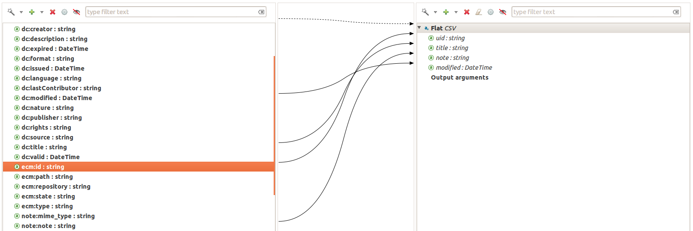

# Nuxeo Mule Connector and DataSense

Here are some notes about Nuxeo and DataSense.

## Nuxeo Objects

### Output / Return objects

A lot of Nuxeo API will return a `Document` object.

A `Document` object is a java object with :

 - a set of fixed read-only fields :

      - getId()
      - getName()
      - getPath()
      - getState()
      - ...

 - a dynamic part returned as a `Map<String,Serializable>` via getProperties()

The structure of the dynamic part actually depends on the Document Type : each doc type is associated to a set a schemas and each schema contains a set of fields.

Nuxeo schemas are technically XSD schemas that supports scalars, multivalued fields and complex fields.

Here are some examples :

      document.getProperties().get("dc:description")

will return a `String`

      document.getProperties().get("dc:subjects")

will return a `List<String>`

      document.getProperties().get("file:content")

will return a `Blob` object (wrapper around a binary stream)

### Input objects

The `Document` object is never used as input of an API call :

 - either we simply send a reference : UUID or Path as String
 - or we only send a part of the Document : typically a part of the properties Map, only the part that needs to be changed

Typically, the `Document.Update` API will take as parameter a `PropertyMap` that can be constructed from a `Map<String,Serializable>` and contains only properties that must be changed.

## DataSense

### Types exposed by the Connector

For now, for each Document Type defined on the server, Nuxeo Connector exposes as 1 *"DataSense type"*.

This means that for a Server that has 2 document types Note and File, Mule connector will expose :

 - File
 - Note

This Mule Type object is similar to a big `Map<String,Object>`

 - DocumentModel object attributes are mapped as properties with the `ecm` namespace

        map.put("ecm:type", doc.getType());
        map.put("ecm:facets", doc.getFacets().list());
        map.put("ecm:id", doc.getId());
        map.put("ecm:lock", doc.getLock());
        map.put("ecm:lockCreated", doc.getLockCreated());
        map.put("ecm:lockOwner", doc.getLockOwner());
        map.put("ecm:path", doc.getPath());
        map.put("ecm:repository", doc.getRepository());
        map.put("ecm:state", doc.getState());

 - all the DataModel properties are added to the same map

    - dublincore properties will be accessible via : map.get("dc:title")
    - note properties will be accessible via : map.get("note:note")

### Method bindings

A lot of Nuxeo API method will return `Document` objects, but is most of the case there is no method parameter that can be used to "guess" what will be the return Doc Type.

For some methods the return type will actually be a list of Documents that can all have different types : the obvious example is a search.

This means that for now, we don't use the Method binding : we just let the user select the Types directly inside the DataMapper.

Here is a sample configuration for a DataMapper : 

    Type : Connector
    Connector : Nuxeo
    By Type
    Type : File

### Field names, ":", Mapper and problems

Nuxeo fields names use prefix : `dc:description`, `file:content`, `note:note` ...

When exposing these fields via DataSense, it looks like the generated *'Mapper script'* looks something like : 

    output.dc_title = input.title;
    output.dc_description = input.desc;

NB : here the *"Nuxeo object"* is the output. 

Does this mean that `":"` are prohibited in field names ?

Here is a simple example flow :

     http endpoint > Nuxeo Query > DocumentModelToMap transformer > Mapper > CSV

    <flow name="TestFlowFlow1" doc:name="Test DataSense">
        <http:inbound-endpoint exchange-pattern="request-response" host="localhost" port="8081" doc:name="HTTP"/>
        <nuxeo:query config-ref="Nuxeo" query="select * from Note" doc:name="Query"/>
        <nuxeo:documents-to-list-of-map doc:name="Convert to Map"/>
        <data-mapper:transform config-ref="new_mapping_grf" doc:name="DataMapper to CSV"/>
    </flow>

The resulting MEL script is : 

    output.uid = input.ecm_id;
    output.title = input.dc_title;
    output.note = input.note_note;
    output.modified = input.dc_modified;

Of course it does not work, but in fact the underlying object is never called : so I don't recieve any `get` call even for a bad propertyname

### Additional questions 

#### Wrapping the Document object

The Document object is not a `Map` but a Pojo containing a Map.

It looks like our Object should be accessible via the Map API : **is that correct ?**

If the answer is yes, I see 2 possibles approaches :

 - I can dynamically wrap all returned Document as an Object that will expose a Map like interface
 - May be I can also provide a "resolver" for the Mapper context ? (that's actually what we do in Nuxeo for EL, MVEL, FreeMarker ...)

I would prefer solution 2, but I can do solution 1 if needed.

#### Building Nuxeo Object

When using a Mule Flow to build a Nuxeo Object via a DataMapper :

 - what will be the exact output java type for the DataMapper : a `Map<String,?>` ?
 - could I provide a contructor to build a '*real object'* or should I simply provide converters ?

 

