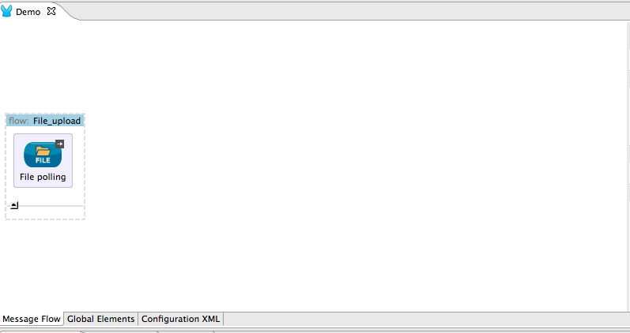
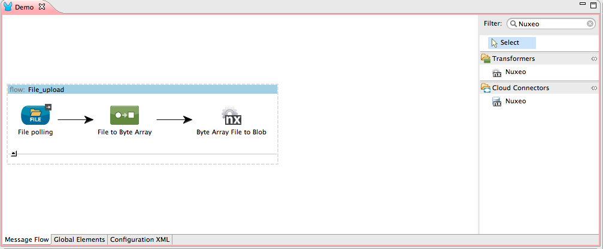

[Purpose](#purpose)  

[Prerequisites](#prerequisites)  

[Step 1: Install a Nuxeo Server ](#step-1)    

[Step 2: Install Mule Nuxeo Connector from update Site](#step-2)   

[Step 3: Create Demo Project](#step3)  

[Step 4: Add Nuxeo Connector in your flow](#step4)   

[Other Resources](#other)    

### Purpose

This document provides detailed instructions on how to install Nuxeo Connector for Mule and demonstrates how to build and run simple demo application that uses this connector.

### Prerequisites

In order to build and run this project you'll need:

* a Nuxeo server
     - You can [download](http://www.nuxeo.com/en/downloads) and [install](http://doc.nuxeo.com/display/ADMINDOC/Installation) a server 
     - You can run against the public [Nuxeo demo server](http://demo.nuxeo.com/nuxeo/)
     - You can use a nuxeo.io instance

* [MuleStudio](http://www.mulesoft.org/download-mule-esb-community-edition).

* Web browser.

### Step 1: Install a Nuxeo Server

Follow instructions on [Adminsitration and Installation](http://doc.nuxeo.com/display/public/ADMINDOC/Installation) documentation of Nuxeo.

### Step 2: Install Mule Nuxeo Connector from update Site

*    In Mule Studio select **Help** \> **Install New Software...**.

*    Select **MuleStudio Cloud Connectors Update Site** in **Work With** drop-down.

*    Check one item from Community folder: **Nuxeo Connector** and click **Next**.

*    Follow installation steps.

Alternatively, you can usee the [update site provided by Nuxeo QA](https://qa.nuxeo.org/jenkins/job/nuxeo-mule-connector-master/lastSuccessfulBuild/artifact/target/update-site/)

### Step 3: Create Demo project

1.    Run Mule Studio and select **File \> New \> Mule Project** menu item. 

1.    Type **Demo** as a project name.

1.    Select CloudHub Mule Runtime for Server Runtime property.

1.    Click **Next** twice

1.    You should be using jdk 1.7 - if not make sure to install it

1.    Click next once again then click **finnish** to end up the wizzard. You should now be in front of an empty flow editor.

1. Global configuration of a Nuxeo Server

   We need to declare globally the Nuxeo connections that we will use. For this tutorial, we need to create a connection to Nuxeo demo server: http://demo.nuxeo.com (Administrator/Administrator)
   
   1. Click on Global Elements tab, then Create, Filter using "Nuxeo" and choose the Cloud Connector
   
   1. Fill username Administrator, password Administrator, Server Name : http://demo.nuxeo.com Port:80 (or localhost:8080). 

   

   
   1. Save and go back to your flows view.

### Step 4: Implement a flow that uploads a file in Nuxeo

**Goal**: we want to poll a specific folder in the file system so that each time a file is dropped there, it is uploaded in Nuxeo, under the */default-domain/workspaces* folder.	

1. Drop a File endpoint in the middle of the flow editor. This will create a new flow called "DemoFlow1".

1. Select it, this opens the property editor for this element on the bottom part of the screen. Rename it "File_upload". Let other option as is.

1. Select the File Endpoint inside File_upload flow and edit its properties on the bottom part:
   1. **Display name**: File polling
   
   1. **Path**: select a path where you will drop the files for your tests
   
   1. **Move to directory**: select a path where the files will be moved after having been imported to Nuxeo

   
   
   1. Let other properties unchanged, and click back to the flow editor and save it.
   

1. Drop a "File to Byte Array" transformer. This is necessary as we will need to store the file as a variable so as to create the File document first on Nuxeo server, then upload the binary on that document.

1. Drop a "Nuxeo" transformer so as to transform the Byte Array File in a Nuxeo Blob (required by the Nuxeo Connector). Set the following properties then go back to the flow editor and save:
   1. **Display Name**: Byte Array File to Blob
   1. **Operation**: File to Blob

 

1. Drop a "Set Variable" component. Goal is to set the Nuxeo blob as a variable in the flow, so as to re-use it later, once the File document that will hold it has been created. Fill the following properties on the component:
   1. **Display Name**: Set as FileToUpload
   1. **Operation**: Set Variable
   1. **Name**: FileToUpload
   1. **Value**: #[payload]
   
1. Drop a Nuxeo Connector at the end of the flow so as to create the File document on the Nuxeo server. E	dit the following properties:
   1. **Display Name**: Create document
   1. **Config reference**: Choose the Nuxeo config of your choice (the one you created at the begining of this tutorial)
   1. **Operation**: Choose Create Document
   1. **Parent document reference**:/default-domain/workspaces
   1. **Document Type**: File
   #. **name of the document**:Quel est la règle
   1. **properties**: choose "Create Object Manually" then
       1. Select the k:v Map <String,Object> row and click on the "+" icon.
       1. Fill the metadata that should be part of the docuemnt once created:
          1. Name: dc:title  Value: #[filename]
          1. Name: dc:description: Value : a decription of the file
            

    1. Go back to the flow editor and save

1.  Drop between the File polling component and File to Byte array a set variable component. 
Set the variable "filename" to #[message.inboundProperties['originalFilename']]. Goal is store the filename across the flow. 

    

   
To be continued

### Other Resources

For more information on:

- Nuxeo Platform, please visit [http://doc.nuxeo.com/](http://doc.nuxeo.com/display/MAIN/Nuxeo+Documentation+Center+Home)

- Nuxeo Automation API, please visit [http://doc.nuxeo.com/display/NXDOC/Platform+APIs#PlatformAPIs-RESTAPI](http://doc.nuxeo.com/display/NXDOC/Platform+APIs#PlatformAPIs-RESTAPI)

- Mule AnyPoint™ connectors, please visit [http://www.mulesoft.org/connectors](http://www.mulesoft.org/connectors)

- Mule platform and how to build Mule apps, please visit [http://www.mulesoft.org/documentation/display/current/Home](http://www.mulesoft.org/documentation/display/current/Home)

